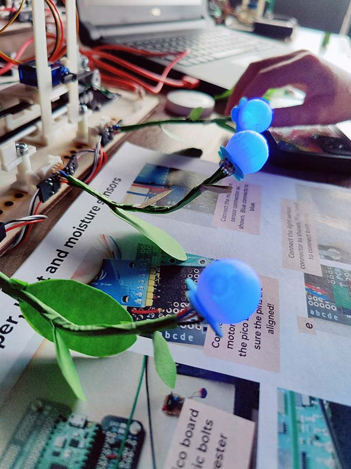

# Girls Into Coding Plant Harvester Workshop

In this workshop, "digital plants" are grown, using light and moisture sensors to determine the rate of growth.  The fruits ripen from green to red, at which point they can be harvested by cutting them down.

Uses a Raspberry Pi Pico, running CircuitPython.  This repo is the CircuitPython code.

### pico
Starter code for the Raspberry Pi Pico

### pico-solution
Possible solution.

### designs
2D and 3D designs

---

Please go to [www.thinkcreatelearn.co.uk](www.thinkcreatelearn.co.uk) for more details.
